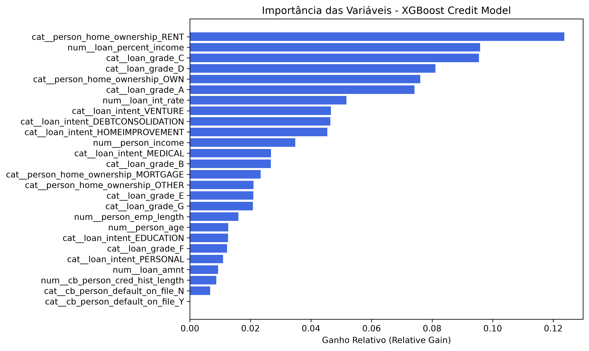
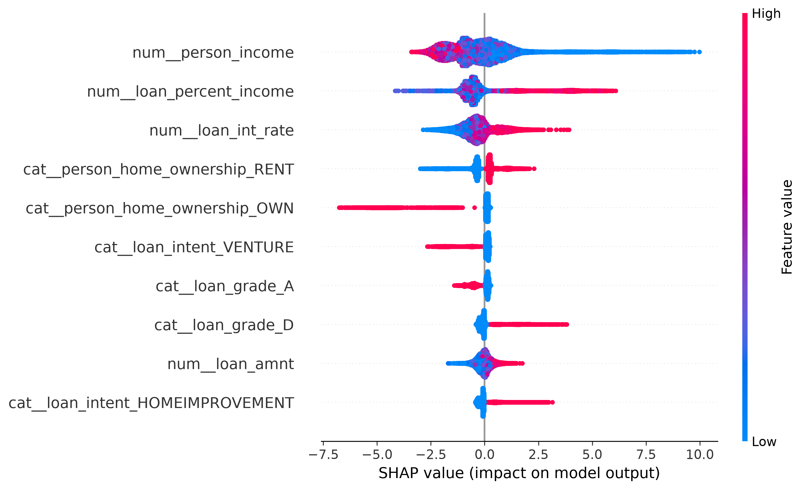

# Sistema de Avaliação de Risco de Crédito End-to-End

[](https://fastapi.tiangolo.com/)
[](https://xgboost.readthedocs.io/)
[](https://www.docker.com/)
[](https://cloud.google.com/run)

Este repositório contém uma solução completa para a predição e análise de risco de crédito. O projeto engloba desde a análise exploratória e tratamento de dados brutos até a esteira de deployment, expondo um modelo preditivo baseado em **XGBoost** através de uma API de alta performance desenvolvida em **FastAPI**, empacotada com **Docker** e hospedada no **Google Cloud Run**.

---

## 1. O Problema de Negócio

No setor financeiro, a concessão de crédito é uma das principais fontes de receita, mas também carrega o maior risco operacional: a **inadimplência (default)**. Liberar crédito para clientes com alto potencial de calote gera prejuízos diretos ao caixa da instituição, enquanto negar crédito para bons pagadores resulta em perda de receita e custo de oportunidade.

**Objetivo do Projeto:** Desenvolver um sistema automatizado capaz de receber dados cadastrais e financeiros de uma proposta de empréstimo em tempo real e classificar o cliente entre:
*   `LOW_RISK` (Baixo Risco / Crédito Recomendado)
*   `HIGH_RISK` (Alto Risco / Crédito Suspenso ou Sujeito à Análise Manual)

---

## 2. Os Dados & Dicionário de Variáveis

O conjunto de dados original conta com **32.581 linhas** e **12 colunas**, representando o histórico de solicitações de crédito de uma instituição financeira. Os dados brutos foram extraídos publicamente da plataforma Kaggle através do link: [Credit Risk Dataset](https://www.kaggle.com/datasets/laotse/credit-risk-dataset/data).

### Dicionário de Variáveis (Schema da API)

| Campo | Tipo | Descrição | Exemplo |
| :--- | :--- | :--- | :--- |
| `person_age` | `int` | Idade do solicitante | `30` |
| `person_income` | `int` | Renda anual do solicitante | `50000` |
| `person_home_ownership` | `str` | Situação de moradia (`RENT`, `OWN`, `MORTGAGE`, `OTHER`) | `"RENT"` |
| `person_emp_length` | `float` | Tempo de emprego atual em anos | `5.0` |
| `loan_intent` | `str` | Objetivo do empréstimo (Ex: `PERSONAL`, `EDUCATION`, `MEDICAL`) | `"PERSONAL"` |
| `loan_grade` | `str` | Nota de classificação de risco atribuída ao empréstimo (`A` a `G`) | `"A"` |
| `loan_amnt` | `int` | Valor total do empréstimo solicitado | `10000` |
| `loan_int_rate` | `float` | Taxa de juros aplicada ao empréstimo (%) | `11.5` |
| `loan_percent_income` | `float` | Percentual da renda anual comprometida com o empréstimo (0 a 1) | `0.20` |
| `cb_person_default_on_file` | `str` | Histórico de inadimplência registrado no histórico do cliente (`Y`/`N`) | `"N"` |
| `cb_person_cred_hist_length`| `int` | Tempo de histórico de crédito ativo em anos | `3` |

---

## 3. Engenharia de Recursos & Escolha do Modelo

### Pré-Processamento e Pipeline
Os dados brutos passaram por uma higienização rigorosa mapeada em um pipeline automatizado (`ColumnTransformer`):
1.  **Tratamento de Outliers:** Foram eliminados registros com outiliers na idade biologica ($\ge 100$ anos) e tempos de emprego inconsistentes ($\ge 60$ anos).
2.  **Imputação de Nulos:** Variáveis cruciais que continham dados faltantes — como tempo de emprego (**2,75% de nulos**) e taxa de juros (**9,56% de nulos**) — foram tratadas dinamicamente utilizando a **Mediana** (`SimpleImputer`), evitando vieses causados pela média em distribuições assimétricas.
3.  **Padronização e Codificação:** As variáveis numéricas foram normalizadas com `StandardScaler` e as categóricas foram transformadas em variáveis binárias via `OneHotEncoder`, expandindo a matriz final de treinamento para **26 features estruturadas**.

### Por que escolher o XGBoost?
O algoritmo **XGBoost (Extreme Gradient Boosting)** foi selecionado devido à sua performance superior no tratamento de dados tabulares não lineares, velocidade de processamento e robustez contra *overfitting*. Além disso, foi configurado o hiperparâmetro `scale_pos_weight=3` para compensar o desbalanceamento natural da base (onde apenas **21,81%** dos dados históricos pertenciam à classe de inadimplentes).

---

## 4. Estrutura de Treinamento & Dinâmica dos Pesos do Modelo

Para garantir a capacidade de generalização do modelo e mitigar o vazamento de dados (*data leakage*), o fluxo de modelagem seguiu uma esteira estatística rígida baseada no algoritmo **XGBoost (Extreme Gradient Boosting)**.

### Volumetria e Divisão dos Dados
O dataset higienizado foi dividido utilizando o método holdout clássico na proporção **80/20** via Scikit-Learn:
*   **Base de Treinamento ($X_{train}$):** 26.059 registros dedicados exclusivamente ao ajuste de pesos e aprendizado do modelo.
*   **Base de Teste ($X_{test}$):** 6.515 registros totalmente isolados, utilizados apenas na validação final.

> **Divisão Estratificada:** Como a base é desbalanceada (apenas 21,81% de casos de inadimplência), aplicou-se a técnica de estratificação (`stratify=y`) na quebra do dataset. Isso forçou o algoritmo a manter exatamente os mesmos 21,81% de proporção de calotes tanto no treino quanto no teste, evitando sub-representação estatística na validação.

### Como os "Pesos" e o Treinamento Funcionam de Fato
Diferente de modelos lineares que atribuem um peso fixo para cada variável, o XGBoost cria um comitê de centenas de árvores de decisão que aprendem de forma sequencial (Boosting). O cálculo e relevância dos dados funcionam sob três pilares:

1.  **Minimização Estatística de Resíduos:** O modelo começa criando uma árvore simples. A segunda árvore é treinada focado puramente em corrigir os erros (resíduos) da primeira árvore, a terceira foca em corrigir os erros da segunda, e assim sucessivamente.
2.  **Ganho de Informação (*Gain*):** Os "pesos" de importância de cada variável (como renda ou histórico) são calculados dinamicamente com base no quanto cada quebra de nó reduz o erro global do modelo. Variáveis inconsistentes ou contraditórias anulam o ganho de informação, gerando penalizações pesadas na folha final.
3.  **Função de Perda Penalizada (`scale_pos_weight=3`):** Para mitigar o desbalanceamento dos dados, a função de perda foi matematicamente alterada. O peso do erro para falsos negativos (aprovar um cliente inadimplente) foi multiplicado por 3. Isso introduz um viés conservador de proteção ao caixa da instituição financeira, tornando o modelo extremamente rigoroso e focado em segurança operacional.

### Engenharia Integrada via Pipeline
Todo esse comportamento foi encapsulado usando um objeto `Pipeline` unificado:
1.  **`preprocessor` (`ColumnTransformer`):** Isole as transformações e aplica a mediana (`SimpleImputer`) e padronização (`StandardScaler`/`OneHotEncoder`) gerando as 26 features finais em tempo de execução.
2.  **`classifier` (`XGBClassifier`):** O estimador processado.

O comando `model.fit(X_train, y_train)` disparou essa esteira de forma limpa. O pipeline final foi serializado em produção via `joblib`, garantindo que a API FastAPI execute exatamente as mesmas transformações matemáticas do treino ao receber dados brutos em tempo real.

---

## 5. Avaliação do Modelo (Evaluation & Métricas)

O modelo foi validado utilizando a base de teste correspondente aos 20% isolados (6.515 registros).

Os resultados obtidos na validação final foram:
*   **Acurácia Geral:** 92%
*   **ROC AUC Score:** 0.9481 (Excelente capacidade de discriminação e separabilidade entre classes)

### Relatório de Classificação Detalhado

```text
              precision    recall  f1-score   support

  0 (Adimplente)   0.94      0.96      0.95      5094
1 (Inadimplente)   0.85      0.79      0.82      1421
```

### Interpretabilidade do Modelo (XAI)

#### Feature Importance

Para reduzir o efeito de **"caixa-preta"** característico de modelos baseados em árvores (*Gradient Boosting*), foi realizada uma análise de **Feature Importance** utilizando o critério de **Ganho Relativo (*Gain*)**. Essa métrica quantifica a contribuição de cada variável para a redução do erro do modelo ao longo de todas as divisões das árvores.

Os três principais fatores que influenciam as decisões do modelo são:

- **`person_home_ownership_RENT` (Moradia em Aluguel):**  
  Representa a variável de maior importância, com peso superior a **12%**. O modelo identificou que clientes que residem em imóveis alugados apresentam, historicamente, maior vulnerabilidade financeira, tornando essa característica um dos principais indicadores de risco de inadimplência.

- **`loan_percent_income` (Comprometimento da Renda):**  
  Segunda variável mais relevante, com importância próxima de **10%**. Esse atributo mede a proporção da renda comprometida pelo empréstimo, evidenciando que o modelo prioriza a capacidade financeira do cliente em honrar a dívida sem comprometer excessivamente seu orçamento.

- **`loan_grade_C` / `loan_grade_D` (Classificação Intermediária de Risco):**  
  Essas categorias exercem forte influência nas decisões do algoritmo, funcionando como importantes indicadores estatísticos para o aumento da probabilidade de inadimplência.

A hierarquia das variáveis demonstra que o modelo foi capaz de aprender **relações não lineares complexas**, priorizando aspectos estruturais da saúde financeira do cliente em vez de depender apenas de métricas isoladas. Essa análise aumenta a transparência do processo decisório e fornece evidências de que as previsões estão fundamentadas em fatores estatisticamente relevantes.



#### SHAP Summary Plot (Impacto e Direção do Risco)

Enquanto o gráfico de ganho mostra quais variáveis organizam melhor a estrutura das árvores, os **SHAP Values** revelam a **magnitude acumulada e a direção do impacto** de cada atributo na decisão final aplicada aos clientes.



A análise do SHAP traz revelações sobre o comportamento não linear do modelo:

- **A Supremacia da Renda (`person_income`):** Embora o aluguel (`RENT`) seja o filtro inicial mais eficiente para o algoritmo, a renda anual do cliente é o fator que causa os impactos mais extremos. Níveis muito baixos de renda (pontos azuis) esticam o risco de inadimplência de forma violenta para a extrema direita do gráfico, sendo o principal fator isolado de reprovação.
- **O Efeito Interruptor do Aluguel (`RENT` vs `OWN`):** O SHAP desmistifica o vínculo de moradia. O fato de morar de aluguel (`RENT` em vermelho) atua como um penalizador constante, empurrando o score de risco uniformemente para a direita. Em contrapartida, possuir casa própria (`OWN` em vermelho) dispara uma linha maciça para a extrema esquerda, funcionando como o maior atenuador de risco do modelo (passaporte para aprovação automática).
- **Comprometimento de Renda (`loan_percent_income`):** Fica claro visualmente que valores altos (pontos vermelhos) asfixiam o orçamento e deslocam o cliente diretamente para a zona de inadimplência (direita).

---


## 6. Testes de Estresse & Calibração de Threshold

Para garantir que o modelo XGBoost aprendeu os padrões financeiros reais e mitigar o risco de *overfitting*, a aplicação foi submetida a cenários de estresse simulando fraudes, inconsistências severas e perfis de fronteira na zona de incerteza, além de um controle de aprovação ideal.

### Resultados dos Cenários de Teste

| Cenário Analisado | Perfil do Payload Enviado | Probabilidade de Calote | Ação do Sistema (Após Calibração) | Diagnóstico de Engenharia |
| :--- | :--- | :---: | :---: | :--- |
| **1. Lobo em Pele de Cordeiro** | Renda altíssima ($850k), casa própria, estabilidade, mas com restrição ativa (`default=Y`) e `Grade G`. | **93.96%** | RECUSA AUTOMÁTICA | **Padrão de Risco Confirmado.** O modelo isolou corretamente a renda alta e priorizou o histórico negativo e a nota de crédito. |
| **2. Jovem Alavancado** | Cliente de 21 anos, nota boa (`Grade B`), histórico limpo, mas pedindo empréstimo maior que a renda anual (`comprometimento: 150%`). | **99.87%** | RECUSA AUTOMÁTICA | **Padrão de Risco Confirmado.** O algoritmo capturou com precisão o risco matemático crítico de superendividamento. |
| **3. Perfil Fantasma (Fraude)** | Inconsistência temporal extrema: tempo de emprego e histórico de crédito incompatíveis com a idade. Renda baixa. | **99.29%** | RECUSA AUTOMÁTICA | **Padrão de Risco Confirmado.** O XGBoost identificou o ruído nas variáveis temporais combinadas ao baixo score original. |
| **4. Trabalhador Silencioso** | Cliente jovem, renda modesta ($42k), mora de aluguel, mas com histórico impecável, estável e pedido pequeno (`comprometimento: 7%`). | **56.72%** | REVISÃO MANUAL | **Zona de Fronteira Mapeada.** O perfil equilibrado (baixo comprometimento vs. baixa renda/aluguel) acionou a esteira de auditoria humana por segurança. |
| **5. Cliente Padrão Ouro** | Idade madura, excelente renda ($145k), imóvel financiado, zero restrições, nota máxima (`Grade A`) e baixo comprometimento ($8\%$). | **4.38%** | APROVAÇÃO AUTOMÁTICA | **Padrão Saudável Confirmado.** O algoritmo demonstra convergência e alta convicção para liberação de crédito limpo. |

### Política de Decisão Baseada em Threshold Ponderado

A modelagem de risco puramente estatística tende a ser conservadora devido à penalização aplicada no treinamento (`scale_pos_weight=3`), o que desloca perfis saudáveis de baixa renda (como o **Cenário 4**) para zonas cinzentas de probabilidade. Manter um ponto de corte (*threshold*) fixo e binário em 50% causaria um severo custo de oportunidade para a instituição, rejeitando de forma automatizada clientes com bom comportamento de crédito.

Para resolver essa limitação a solução foi desenhada para separar a **Previsão Estatística** (XGBoost) da **Regra de Decisão de Negócio** (camada da API). Implementou-se uma política de governança baseada em **Três Zonas de Risco**, otimizando a esteira de crédito:

*   🟢 **Zona Verde (Aprovação Automática) \| $\le$ 45%:** Operações de altíssima segurança (ex: **Cenário 5** com 4.38%). O crédito é concedido instantaneamente sem fricção.
*   🟡 **Zona Amarela (Mesa de Análise / Revisão) \| 45% a 65%:** Casos de fronteira onde há indicadores saudáveis misturados a dados marginais (ex: **Cenário 4** com 56.72%). A API suspende a automação e direciona o contrato para auditoria manual (`MANUAL_REVISION_REQUIRED`), salvando o cliente da recusa indevida.
*   🔴 **Zona Vermelha (Recusa Automática) \| $>$ 65%:** Convicção estatística clara de inadimplência ativa ou fraude (ex: **Cenários 1, 2 e 3**). O sistema barra o avanço da proposta imediatamente para proteção de caixa.

---

## 7. Arquitetura da Solução

- **Treinamento:** O modelo e todo o pipeline de pré-processamento (`ColumnTransformer`) foram exportados em conjunto, de forma serializada, em um único arquivo `.joblib`.

- **Serviço:** Uma API REST foi construída utilizando **FastAPI**. A aplicação carrega automaticamente o arquivo `.joblib` na inicialização do servidor e disponibiliza predições com baixa latência, em milissegundos.

- **Containers:** Toda a aplicação (código-fonte e dependências Python) foi isolada e empacotada por meio de um `Dockerfile`, garantindo portabilidade e consistência entre ambientes.

- **Nuvem:** O deploy contínuo é realizado no **Google Cloud Run**, uma plataforma *serverless* totalmente gerenciada, capaz de escalar automaticamente conforme a demanda de requisições.

- **Otimização de Deploy:** O arquivo `.gcloudignore` foi configurado para excluir o ambiente virtual local (`.venv`), com aproximadamente **741 MB**, reduzindo significativamente o contexto de build e proporcionando deploys mais rápidos e eficientes na nuvem.

---

## 8. Como Testar e Consumir a API

A API está implantada publicamente no Google Cloud Run e pode ser acessada diretamente através do link:
👉 [Credit Risk API](https://credit-risk-api-545386638841.us-central1.run.app/docs)

### Opção 1: Testando Direto pelo Navegador
1. Acesse o link da API acima.
2. Clique sobre o endpoint **`POST /predict`**.
3. Clique no botão **Try it out** no canto superior direito do bloco.
4. Altere os valores do JSON de exemplo ou use o payload de teste já preenchido.
5. Clique no botão azul **Execute** e veja o retorno do modelo instantaneamente na seção *Response body*.

### Opção 2: Consumindo a API via Terminal (cURL)
Você pode disparar uma requisição de teste de qualquer terminal rodando o comando abaixo:

```bash
curl -X 'POST' \
  'https://credit-risk-api-545386638841.us-central1.run.app/predict' \
  -H 'accept: application/json' \
  -H 'Content-Type: application/json' \
  -d '{
  "person_age": 24,
  "person_income": 54400,
  "person_home_ownership": "RENT",
  "person_emp_length": 8.0,
  "loan_intent": "MEDICAL",
  "loan_grade": "C",
  "loan_amnt": 35000,
  "loan_int_rate": 14.27,
  "loan_percent_income": 0.55,
  "cb_person_default_on_file": "Y",
  "cb_person_cred_hist_length": 4
}'

```

## 9. Exemplos de Requisição e Resposta

### JSON de Entrada (Payload)

```json
{
  "person_age": 24,
  "person_income": 54400,
  "person_home_ownership": "RENT",
  "person_emp_length": 8.0,
  "loan_intent": "MEDICAL",
  "loan_grade": "C",
  "loan_amnt": 35000,
  "loan_int_rate": 14.27,
  "loan_percent_income": 0.55,
  "cb_person_default_on_file": "Y",
  "cb_person_cred_hist_length": 4
}
```

### JSON de Retorno (Response)

```json
{
  "approved": false,
  "default_probability": 0.9994,
  "risk_grade": "HIGH_RISK",
  "action_required": "AUTOMATIC_REFUSAL"
}
```